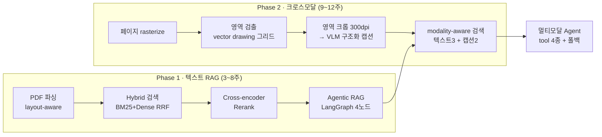

# 매뉴얼 도면을 읽는 RAG — Advanced RAG에서 Cross-modal Agent까지

**LG 가전 매뉴얼(한국어 PDF 6종)을 대상으로, 텍스트 RAG → 크로스모달 RAG → Agent로
단계적으로 진화시킨 12주 포트폴리오 프로젝트.**

## 무엇이 문제인가

가전 매뉴얼은 정보를 두 곳에 나눠 담는다. **텍스트에는 조건·주의사항**이, **그림에는 모양·위치·방향**이 있다.

> "AS181DAW 공기청정기에서 조작부는 제품의 어느 면에 있나요?"

본문은 "제품의 기능을 설정할 수 있습니다"라는 **기능만** 적고, 조작부가 윗면에 있다는 사실은
**도면의 지시선에만** 있다. 텍스트 전용 RAG는 정답 페이지를 정확히 찾아내고도 답하지 못한다.

실제로 이런 질문 27개를 직접 만들어 측정한 결과, **텍스트 전용 RAG의 정답은 0/27**이었다
(그중 23건은 지어내지 않고 정직하게 거절했다).

## 어떻게 접근했나



**핵심 설계 판단**: 도면을 이미지 임베딩(CLIP)으로 검색하지 않고, **VLM으로 구조화된 텍스트 캡션을
만들어 기존 텍스트 인덱스에 합류**시켰다. 선화(line-art) 도면 + 한국어 라벨에서 CLIP은
캡션 대비 75% vs 12%로 완패했다 (ADR-012).

## Benchmark

| 주차 | 무엇을 했나 | 핵심 수치 |
|---|---|---|
| 3주 | Baseline (Dense-only) | Top-1 **60.9%** |
| 5주 | Hybrid(BM25+Dense, RRF) + Reranker | Top-1 **91.3%** (21/23), Top-5 100%, 6.73s |
| 6주 | Agentic RAG (LangGraph 4노드 + Self-Query) | Top-1 **95.7%** (23q), 27.01s (4.01x) |
| 7주 | 평가 프레임 (RAGAS + 도메인 메트릭) | Citation model **91.9%**, Faithfulness 0.87 |
| 9주 | 크로스모달 1차 (페이지 캡션) | caption-hit 2/8 → **6/8**, 캡션 75% vs CLIP 12% |
| 11주 | 멀티모달 Agent (tool 4종 + 폴백) | full-page vision으로는 아이콘·위치 **못 뚫음** (정직한 거절) |
| **12주** | **영역 캡션 3-way 비교 (n=27)** | **정답 C0 0/27 → C1page 1/27 → C1region 8/27** |

12주차 상세 (image-required 27문항, 수동 채점):

| 구성 | 정답 | 정답+부분 | 거절 | 지연 |
|---|---|---|---|---|
| C0 텍스트만 | 0/27 | 0/27 | 23 (전부 적절) | 24.3s |
| C1page 페이지 캡션 | 1/27 | 5/27 | 17 (전부 적절) | 25.1s |
| **C1region 영역 캡션** | **8/27** | **12/27** | 13 (5건 부적절) | 25.7s |

유형별로 보면 이득은 **아이콘에 집중**됐다(8문항 중 6문항 정답). **방향은 세 구성 모두 0/4.**
→ `docs/WEEK12_EVALUATION.md`, `adr/ADR-012-crossmodal-conclusion.md`

## 알려진 한계 (정직하게)

- **표본이 작다.** image-required 27문항, 유형별 n=4~8. 1문항이 12~25%p를 움직인다.
- **방향 유형은 실패했다** (0/4). 영역 캡션이 화살표를 기술한 경우에도 생성 단계가
  "화살표 방향으로 열어야 합니다"라는 동어반복을 냈다.
- **근거가 있는데 거절한 사례 6건**(F-GEN). 현재 수치는 캡션 정보량 한계와 생성 실패가 섞인 값이다.
- **영역 캡션은 15페이지에만 존재한다.** 골든셋이 지목한 페이지만 크롭했으므로, 252페이지 전면
  확장 시에도 같은 이득이 나오는지는 **측정하지 않았다**.
- **채점자 = 작성자.** RAGAS·LLM judge를 쓰지 않고 수동 채점했으나, 그 대가로 채점자 편향이 있다.
- **모델 라우팅**: simple/complex 페어에서 잘못된 매뉴얼을 검색하는 사례가 남아 있다(IR-W6).

## 개선 과제

12주차 측정에서 드러난, 근거가 있는 다음 작업들. 우선순위 순.

### A. 검색된 캡션의 형식에 맞게 생성 단계를 고치기 (F-GEN 6건)

C1region 실패 13건 중 **6건은 근거가 이미 컨텍스트에 있었는데 답하지 못한 것**이다.
즉 현재 8/27은 "영역 캡션의 정보량 한계"와 "생성의 활용 실패"가 섞인 값이다. 가설 셋:

1. **캡션 청크가 파편 형식이다.** `region_caption_to_document`가 `label · shape · position · direction`을
   `" · "`로 이어 붙여 `조작부 · 원형, 내부에 기호 · 제품 상단` 같은 조각을 만든다. 모델이 이를
   문서의 서술이 아니라 메타데이터로 취급했을 수 있다 → **자연문 렌더링**으로 바꿔 비교.
2. **답변 프롬프트가 캡션을 근거로 규정하지 않는다.** "컨텍스트에 있는 정보만 사용하세요"뿐이라,
   위치·모양·방향 질문에 `position_in_figure`·`shape`·`direction` 필드를 근거로 쓰라는 지시가 없다.
3. **동어반복 금지 규칙이 없다.** IR-V4는 근거에 `조작부를 위로 열기`가 있는데도
   "화살표 방향으로 열어야 합니다"를 냈다.

**검색을 다시 돌릴 필요가 없다** — `data/week12_rows_*.json`에 문항별 retrieved context 전문이
저장돼 있어, 컨텍스트를 고정한 채 생성만 재실행하는 ablation이 가능하다. 순수 생성 효과를 분리할 수 있다.

### B. 방향 유형(0/4)은 VLM 문장이 아니라 기하로

화살표를 VLM이 서술하길 기대하는 현재 방식은 실패했다. `page.get_drawings()`에서 **화살촉 폴리곤 +
인접 선분**으로 시작점→끝점 벡터를 계산하고, 곡선은 베지어 제어점 순서로 시계/반시계를 판정한다
(IR-V2에서 캡션이 "왼쪽으로 회전"이라 틀렸던 것을 기하로는 맞출 수 있다).
`direction` 필드를 자유문이 아닌 enum(위/아래/좌/우/시계/반시계/끼움/분리)으로 강제.
한계: 페이지 좌표 방향 ≠ 제품 기준 방향("뒤쪽으로 젖힘" 같은 3D 표현은 여전히 어렵다).

### C. 영역 검출 — inset이 분리되지 않는 문제

dilate 0/1/2 스윕으로는 해결되지 않음을 확인했다(현재 값이 최선). 다른 축의 접근:

- **지시선을 먼저 제거하고 연결성 계산.** 지시선은 가늘고 긴 단일 스트로크라 길이/두께 비율로 식별
  가능하다. 점유 그리드에서 빼면 inset 원이 본체에서 떨어진다. (제거한 지시선은 "무엇과 무엇을 잇는가"
  정보로 재활용 가능 — 콜아웃 매핑의 정공법.)
- **inset 원을 명시적으로 검출**해 독립 영역으로 승격.
- **계층적 재분할**: 큰 덩어리는 내부에서 `min_area_ratio`를 낮춰 재귀 검출.

리트머스는 IR-V7 하나 — 최강/강/중/약/정지 슬라이더가 잡히면 성공.

### D. 채점자 편향을 "있다"가 아니라 수치로

현재 문서는 편향의 존재만 기록하고 크기는 모른다. 구성 라벨을 가린 **블라인드 재채점**(20건 규모)으로
채점자 간 일치율을 측정하면 된다. 함께 필요한 것: 유형별 채점 루브릭 사전 확정
(예: 위치 = 면(윗면/앞면) + 상대위치(좌우/상하) 둘 다 맞아야 정답). IR-A8의 "시계 모양"을 부분으로
볼지 정답으로 볼지가 지금은 사후 판단이다.

### E. 통제되지 않은 변수 두 개

- **크롭이 15페이지에만 있다.** C1region은 "항상 크롭이 있는" 유리한 조건에서 측정됐다.
  골든셋이 지목하지 않은 페이지도 크롭해 넣으면 distractor가 늘어 검색이 흔들릴 수 있고, 그게 진짜 성능이다.
  전체는 ~580콜이라 부담되면 랜덤 50페이지만 추가해도 방향성은 보인다.
- **image-helpful 7문항이 평가에서 빠져 있다.** text-only와 image-required 사이의 중간 지대를 볼 수 있는
  유일한 버킷인데 측정하지 않았다 (추가 비용 7문항 × 3구성).

### F. 지연 수치의 측정 조건 불일치 (benchmark 표 주의)

ADR-008에서 같은 Hybrid+Rerank 구성이 **6.73초**였는데 12주차 C0는 **24.3초**다. 검색 구성은
동일한데(first_stage_k=20, top_k=5) **3.6배 격차의 원인이 규명되지 않았다.** 측정 환경 차이일
가능성이 높지만, 확인 전까지 위 benchmark 표의 두 수치는 **직접 비교 대상이 아니다.**

### G. 코드 정리

- `week12_eval.load_questions()`가 `ir_type`을 **CSV 행 인덱스 = questions 리스트 순서**라는 가정으로
  매칭한다. 현재는 맞지만 로더가 행을 건너뛰거나 재정렬하면 조용히 어긋난다 → id 기준 매칭으로.
- `data/week12_rows_*.jsonl.part` 등 체크포인트 잔여 파일 정리.
- 모델 라우팅(IR-W6, simple/complex 오검색)은 Self-Query를 모델명→복잡도 매핑으로 확장하면 되지만,
  27문항 중 해당 실패가 1~2건이라 **우선순위는 낮다.**

## 실행 방법

```bash
python -m venv .venv && source .venv/bin/activate
pip install -r requirements.txt
cp .env.example .env          # OPENAI_API_KEY 입력

# 텍스트 인덱스 → 크로스모달 인덱스
.venv/bin/python -m src.rasterize               # 페이지 이미지 (150dpi)
.venv/bin/python -m src.region_caption week12   # 영역 검출 + 크롭 + VLM 캡션

# 12주차 3-way 평가 (구성당 1프로세스 — 메모리)
.venv/bin/python -m src.week12_eval C0
.venv/bin/python -m src.week12_eval C1page
.venv/bin/python -m src.week12_eval C1region
.venv/bin/python -m src.week12_eval merge

pytest tests/ -q
```

## 데이터

LG전자 공개 사용설명서 PDF 6종 (한국어). 카테고리 3 × 단순/복잡 1개씩:

| 카테고리 | 단순 | 복잡 |
|---|---|---|
| 정수기 | WD325A** | WD520A** |
| 공기청정기 | AS181DAW | AS281DAW |
| 청소기 | K83 (유선) | O958 (무선) |

출처: [LG전자 제품 매뉴얼](https://www.lge.co.kr/support/product-manuals). 총 252페이지.
평가셋 `data/eval/golden_set_v4.csv` 61문항은 **원본 PDF를 직접 보고 손으로 작성**했다.

## 문서

| ADR | 결정 |
|---|---|
| [ADR-008](adr/ADR-008-retrieval-strategy.md) | 검색 전략 — Hybrid(BM25+Dense, RRF) + Reranker |
| [ADR-009](adr/ADR-009-agentic-rag.md) | Agentic RAG (LangGraph 4노드 + Self-Query) |
| [ADR-010](adr/ADR-010-evaluation-framework.md) | 평가 프레임워크 |
| [ADR-011](adr/ADR-011-crossmodal-eval.md) | 크로스모달 평가 프레임 + Run-2 보정 |
| [**ADR-012**](adr/ADR-012-crossmodal-conclusion.md) | **크로스모달 최종 결론 (영역 캡션 채택, 범위 한정)** |

ADR-001~007(도메인·언어·데이터 선정 등)은 `CLAUDE.md` §2에 요약되어 있다.
주차별 상세: `docs/WEEK*_TASKS.md`, `docs/WEEK*_RETROSPECTIVE.md`,
[12주 전체 회고](docs/WEEK12_RETROSPECTIVE.md).

## ADR 작성법
adr/ADR-000-template.md 참고. 기술 선택할 때마다 왜 이 기술을 선택했는지 기록.

## 보안 (Guardrail) 고려사항

성능·평가에 더해, 이 Agentic RAG를 현업에서 안전하게 운영하려면 예측 불가능한 입력과 악의적 context 속에서도 통제되는지 설명할 수 있어야 한다. 본 시스템은 **closed-domain**(LG 가전 매뉴얼 한정, 웹 검색·외부 도구 미사용 — ADR-009)이라 공격 표면이 좁다. 고려한 주요 리스크는 (1) 사용자 질문을 통한 직접 prompt injection/jailbreak, (2) 매뉴얼 PDF 본문·메타데이터를 통한 **간접(indirect) prompt injection**, (3) 검색된 context를 과신해 환각·탈선하는 경우, (4) Phase 2에서 도구(vision·검색 등)가 추가될 때 늘어나는 공격 표면이다. 현재는 검색 외 도구가 없고, **근거 부족 시 거절하는 로직(retry≤2 후 cannot_answer)과 출처 인용(Citation) 강제**가 기본 output guardrail 역할을 한다. 다만 검색된 매뉴얼 텍스트를 그대로 신뢰하므로, 외부에서 매뉴얼을 수집·갱신하게 되면 **context(retrieved chunk) 단계의 guardrail이 필요**해진다. 도구가 추가되는 Phase 2부터는 도구별 최소 권한 제어와 호출 검증을 재평가한다.

**LlamaFirewall 구성요소를 현재 4노드 그래프에 매핑하면 (가드레일 부착 위치):**

- **PromptGuard 2** → ① `retrieve` 직전 **입력(사용자 질문)** 스캔(jailbreak/injection 탐지), ② `grade`/`generate`에 들어가는 **retrieved context** 스캔(간접 injection 방어).
- **Agent Alignment Checks** → `grade_documents`·`rewrite_query`·라우팅 결정이 원래 목표(매뉴얼 QA)에서 이탈하지 않는지 점검(현재 라우팅이 단순해 리스크는 낮음).
- **CodeShield** → 현재 코드 생성·실행이 없어 **N/A**. Phase 2에서 도구 실행이 생기면 도입 검토.

**향후 개선 계획:** Phase 2 도구 도입 시 입력/context guardrail(PromptGuard 2) 시범 적용 + 도구별 권한 제어, 간접 injection 테스트 케이스를 평가셋에 추가. 가드레일 부착 위치 다이어그램(`docs/` 아키텍처 그림)도 그때 함께 갱신한다.
