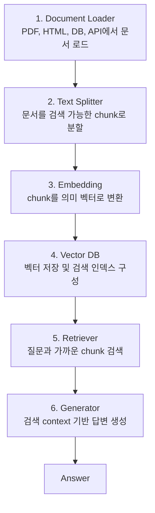
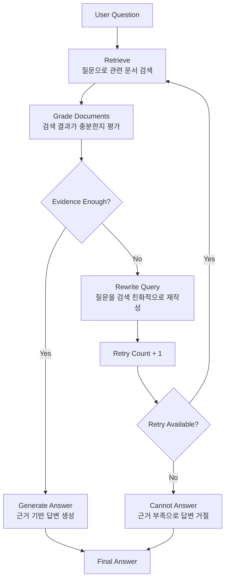

# 6주차 - Advanced RAG 아키텍처

## 0. 이번 시간의 핵심 포인트

**Advanced RAG의 핵심은 검색기를 더 좋게 만드는 것만이 아니라, 검색이 실패했을 때 시스템이 다음 행동을 스스로 선택하게 만드는 것입니다.**

Naive RAG는 보통 `retrieve -> generate` 흐름으로 동작합니다. 빠르고 단순하지만, 검색 결과가 부족하거나 틀렸을 때 그대로 답변 생성 단계로 넘어가기 쉽습니다. Hybrid RAG는 이 고정 흐름 사이에 query enhancement, retrieval validation, answer validation 같은 검증과 보정 단계를 추가합니다.

하지만 Hybrid RAG도 각 단계의 기준, 반복 횟수, fallback 조건을 설계해야 합니다. 검색 실패 이후의 행동을 더 명확하게 제어하려면 Agentic RAG와 LangGraph 기반 상태 관리가 필요합니다.

> Naive RAG는 검색 실패에 약하고, Hybrid RAG는 검증과 보정으로 이를 완화합니다. Agentic RAG는 현재 state를 보고 재검색·질문 재작성·답변 생성·거절·fallback 중 다음 행동을 명시적으로 선택합니다.
> 

## 1. 기준선: Naive RAG 6단계



| 단계 | 역할 | 품질에 미치는 영향 |
| --- | --- | --- |
| Document Loader | PDF, HTML, DB, API 등에서 문서 로드 | 잘못 로드되면 이후 모든 단계가 흔들림 |
| Text Splitter | 문서를 검색 가능한 chunk로 분할 | chunk 크기와 overlap이 검색 품질을 좌우 |
| Embedding | chunk를 의미 벡터로 변환 | 임베딩 모델과 metric 선택이 검색 품질을 제한 |
| Vector DB | 벡터 저장과 검색 인덱스 제공 | 필터링, 확장성, 검색 속도에 영향 |
| Retriever | 질문과 가까운 chunk top-k 검색 | 답변 품질의 상한선을 결정 |
| Generator | 검색 context로 답변 생성 | prompt가 환각과 출처 표시를 제어 |

Advanced RAG는 기존 Naive RAG 위에 **평가, 재검색, 질문 재작성, 거절, fallback** 같은 제어 흐름을 추가하는 것입니다.

## 2. 왜 Naive/Hybrid RAG로는 부족한가

### 2-1. Naive RAG의 단일 파이프라인 한계

Naive RAG는 가장 단순한 RAG 구조입니다.

```
Question -> Retrieve -> Generate -> Answer
```

장점은 명확합니다.

- 구조가 단순합니다.
- 빠르게 구현할 수 있습니다.
- 실행 흐름이 예측 가능합니다.
- 단순 문서 QA에는 충분히 효과적입니다.

하지만 단일 파이프라인 구조에서는 **검색 실패가 곧 답변 실패로 이어지기 쉽습니다.** 검색 품질이 낮아도 결과가 그대로 생성 단계로 전달되고, 재검색이나 거절 같은 안전 장치가 기본적으로 없습니다.

Naive RAG의 대표적인 문제는 다음과 같습니다.

- 검색 결과가 부족해도 생성 단계로 그대로 넘어갑니다.
- 검색 결과가 질문과 맞지 않아도 답변 생성을 시도합니다.
- 재시도나 query rewrite 흐름이 기본적으로 없습니다.
- context가 부족할 때 LLM이 빈칸을 hallucination으로 메울 수 있습니다.
- 의료, 법률, 금융처럼 정확성이 중요한 도메인에서는 잘못된 답변이 실제 위험으로 이어질 수 있습니다.

따라서 중요한 것은 “항상 답하는 능력”이 아니라, **근거가 부족하면 다시 검색하거나 답변을 거절하는 능력**입니다.

### 2-2. Hybrid RAG

공식 문서 기준으로 Hybrid RAG는 **2-Step RAG와 Agentic RAG의 특성을 함께 가진 중간 형태의 RAG 아키텍처**입니다.

2-Step RAG는 항상 검색을 먼저 수행하고, 그 결과를 바탕으로 답변을 생성합니다. 구조가 단순하고 빠르지만, 검색 결과가 부족하거나 잘못되었을 때 이를 스스로 검증하거나 보정하기 어렵습니다.

반면 Agentic RAG는 LLM 기반 agent가 추론 과정에서 언제 검색할지, 어떤 도구를 사용할지, 다시 검색할지 등을 더 유연하게 결정합니다. 하지만 그만큼 실행 흐름이 복잡해지고 latency와 비용이 증가할 수 있습니다.

Hybrid RAG는 이 둘의 중간에 위치합니다. 완전히 자유로운 agent 구조까지는 가지 않더라도, 고정된 `retrieve -> generate` 흐름 사이에 검증과 보정 단계를 추가합니다.

여기서 Agentic RAG와의 경계를 명확히 잡아야 합니다. **Hybrid RAG는 고정된 RAG 파이프라인 사이에 검증과 보정 단계를 추가한 구조**이고, **Agentic RAG는 현재 state를 보고 검색 여부, 도구 선택, 재검색, 거절, fallback 같은 다음 행동을 더 동적으로 선택하는 구조**입니다.

| 구성 요소 | 설명 | 목적 |
| --- | --- | --- |
| Query Enhancement | 사용자의 질문을 검색에 더 적합하게 재작성하거나 여러 변형 query 생성 | 검색 품질 개선 |
| Retrieval Validation | 검색된 문서가 질문에 답하기 충분한지 평가 | 부적절한 context 차단 |
| Iterative Retrieval | 검색 결과가 부족하면 query를 수정해 다시 검색 | 첫 검색 실패 보정 |
| Answer Validation | 생성된 답변이 context와 일치하는지, 질문에 충분히 답했는지 확인 | hallucination 완화 |
| Regeneration / Revision | 답변이 부족하면 다시 생성하거나 수정 | 최종 답변 품질 개선 |

즉 Hybrid RAG는 단순한 검색 조합이 아니라, **검색 전후에 검증과 보정 단계를 추가한 RAG 구조**입니다.

### 2-3. Hybrid RAG의 기본 흐름

!image.png

Hybrid RAG는 검색 전에 질문을 보정하고, 검색 후에는 문서가 충분한지 확인하며, 답변 생성 후에는 답변이 근거와 맞는지 다시 확인할 수 있습니다.

### 2-4. Hybrid RAG도 여전히 한계가 있다

Hybrid RAG는 Naive RAG보다 안정적이지만, 여전히 한계가 있습니다.

첫째, 검증 단계가 많아질수록 latency와 비용이 증가합니다. Query enhancement, retrieval validation, answer validation은 대부분 추가 LLM 호출이나 추가 검색을 필요로 합니다.

둘째, 각 단계의 기준을 사람이 설계해야 합니다. 어떤 경우에 재검색할지, 어떤 점수 이하일 때 답변을 거절할지, 몇 번까지 반복할지는 별도로 정해야 합니다.

셋째, 조건부 흐름이 많아질수록 단순 chain으로 관리하기 어려워집니다. 이때 LangGraph처럼 State, Node, Conditional Edge를 명시적으로 다룰 수 있는 구조가 필요해집니다.

## 3. Agentic RAG란 무엇인가

**Agentic RAG는 현재 State를 기반으로 검색, 재검색, 질문 재작성, 생성, 거절, fallback 중 다음 행동을 조건부로 선택하는 구조입니다.**

Agentic RAG는 다음 질문에 답합니다.

- 지금 검색이 필요한가?
- 검색된 문서가 질문에 충분히 관련 있는가?
- 질문을 검색 친화적으로 다시 써야 하는가?
- 다시 검색해야 하는가?
- 답변을 생성해도 되는가?
- 근거가 부족하므로 답변을 거절해야 하는가?

따라서 Agentic RAG의 본질은 도구를 많이 붙이는 것이 아닙니다. 핵심은 **현재 상태를 보고 다음 행동을 선택하는 제어 구조**입니다.

| 구분 | 핵심 |
| --- | --- |
| Naive RAG | `retrieve -> generate` 고정 흐름 |
| Hybrid RAG | 고정 흐름 사이에 query enhancement, retrieval validation, answer validation 추가 |
| Agentic RAG | state를 보고 다음 행동을 조건부로 선택하는 제어 구조 |

이 구분은 LangGraph의 workflow와 agent 구분과도 맞닿아 있습니다. workflow는 사전에 정해진 코드 경로와 순서를 따르는 구조이고, agent는 더 동적으로 자신의 프로세스와 도구 사용을 정의합니다. 

Hybrid RAG는 비교적 정해진 파이프라인을 보강한 workflow에 가깝고, Agentic RAG는 state 기반으로 실행 경로를 더 동적으로 선택하는 agentic control에 가깝습니다.

### 3-1. Agentic RAG 전체 흐름



Agentic RAG는 “한 번 더 검색하는 RAG”가 아니라, **검색 실패를 안전하게 처리하는 RAG**입니다.

## 4. LangGraph로 구현하는 Agentic RAG

Agentic RAG를 구현하려면 상태와 분기를 명시적으로 다루는 구조가 필요합니다. LangGraph는 이 흐름을 `State`, `Node`, `Edge`, `Conditional Edge`로 표현합니다.

| 개념 | 의미 |
| --- | --- |
| State | 그래프 전체가 공유하는 현재 상태 |
| Node | State를 읽고 처리한 뒤 State update를 반환하는 함수 |
| Edge | 노드와 노드를 연결하는 경로 |
| Conditional Edge | State 값에 따라 다음 노드를 다르게 선택하는 분기 |

### 4-1. State

State에는 현재 질문, 재작성된 질문, 검색 문서, 답변, 평가 결과, 재시도 횟수처럼 그래프 실행에 필요한 값을 넣습니다.

```python
from typing import Any, List
from typing_extensions import TypedDict

class GraphState(TypedDict, total=False):
    question: str
    rewritten_question: str
    documents: List[Any]
    answer: str
    grade_result: str
    retry_count: int
    max_retry: int
```

LangGraph의 State는 단순한 dict가 아닙니다. 각 key마다 값을 덮어쓸지, 누적할지 정할 수 있습니다.

```python
from typing import Annotated
from operator import add
from typing_extensions import TypedDict
from langgraph.graph.message import add_messages

class RAGState(TypedDict):
    documents: list[str]                      # 현재 후보 문서: overwrite
    query_history: Annotated[list[str], add]  # 재검색 이력: append
    retrieval_log: Annotated[list[dict], add] # 검색 로그: append
    messages: Annotated[list, add_messages]   # 대화 히스토리 관리
```

| State key | 추천 갱신 방식 | 이유 |
| --- | --- | --- |
| documents | overwrite | 현재 검색 결과만 generation에 사용 |
| rewritten_question | overwrite | 최신 재작성 질문만 사용 |
| query_history | append | 어떤 query를 거쳤는지 추적 |
| retrieval_log | append | 디버깅과 재현성 확보 |
| messages | add_messages | 대화 히스토리와 수정 반영 |

### 4-2. Node

Node는 State를 입력받아 하나의 작업을 수행하고, State update를 반환하는 함수입니다.

```python
### 4-2. Node
from typing_extensions import TypedDict
from langgraph.graph import StateGraph, START, END

class State(TypedDict):
    input: str
    results: str

def plain_node(state: State):
    return {"results": f"Hello, {state['input']}!"}

builder = StateGraph(State)
builder.add_node("plain_node", plain_node)

builder.add_edge(START, "plain_node")
builder.add_edge("plain_node", END)

graph = builder.compile()
```

### 4-3. Conditional Edge

Conditional Edge는 특정 노드가 실행된 뒤, 현재 `State` 값을 보고 다음에 실행할 노드를 동적으로 선택하는 분기입니다.

일반 Edge는 항상 정해진 다음 노드로 이동합니다.

```python
workflow.add_edge("retrieve", "grade_documents")
```

반면 Conditional Edge는 routing function의 반환값에 따라 다음 노드가 달라집니다.

Agentic RAG에서는 `grade_documents` 이후의 분기가 핵심입니다. 검색 결과가 충분하면 답변을 생성하고, 부족하지만 재시도 가능하면 질문을 다시 쓰고, 재시도 한도를 넘으면 답변 불가 처리로 이동합니다.

```python
from typing import Literal

def decide_next_step(
    state: GraphState,
) -> Literal["generate", "rewrite_query", "cannot_answer"]:
    if state.get("grade_result") == "relevant":
        return "generate"

    if state.get("retry_count", 0) >= state.get("max_retry", 1):
        return "cannot_answer"

    return "rewrite_query"
```

위 함수는 실제 노드를 실행하는 함수가 아니라, **다음에 어느 노드로 갈지 결정하는 라우팅 함수**입니다.

이 라우팅 함수는 `add_conditional_edges()`로 그래프에 등록합니다.

```python
workflow.add_conditional_edges(
    "grade_documents",      # 이 노드가 끝난 뒤
    decide_next_step,       # 이 함수로 다음 경로를 결정
    {
        "generate": "generate",
        "rewrite_query": "rewrite_query",
        "cannot_answer": "cannot_answer",
    },
)
```

이 코드는 다음 의미를 가집니다.

| `decide_next_step()` 반환값 | 다음 노드 | 의미 |
| --- | --- | --- |
| `"generate"` | `generate` | 검색 결과가 충분하므로 답변 생성 |
| `"rewrite_query"` | `rewrite_query` | 검색 결과가 부족하지만 재시도 가능하므로 질문 재작성 |
| `"cannot_answer"` | `cannot_answer` | 재시도 한도를 넘었으므로 답변 불가 처리 |

이후 각 노드의 흐름은 다음처럼 연결합니다.

```python
workflow.add_edge("rewrite_query", "retrieve")
workflow.add_edge("generate", END)
workflow.add_edge("cannot_answer", END)
```

정리하면 Conditional Edge는 Agentic RAG에서 **검색 결과를 평가한 뒤 다음 행동을 선택하는 핵심 제어 장치**입니다.

```
grade_documents
    ├── relevant → generate
    ├── not relevant + retry 가능 → rewrite_query → retrieve
    └── not relevant + retry 초과 → cannot_answer
```

## 5. Routing과 Fallback

핵심은 검색이 실패했을 때 어떤 corrective action을 선택할지입니다.

```
검색 결과가 부족함
-> 질문 재작성
-> 재검색
-> 재시도 한도 초과
-> 답변 불가 처리
```

| 실패 유형 | 가능한 대응 |
| --- | --- |
| 문서는 많이 오지만 노이즈가 많음 | rerank, 문서 단위 filtering, threshold 조정 |
| 답이 될 근거가 거의 없음 | query rewrite, top-k 증가, filter 완화, 검색 범위 확장 |
| 내부 문서에 없는 최신 정보 필요 | 선택적 web search |
| 재시도 후에도 근거 부족 | cannot_answer |

## 6. 운영과 평가

Agentic RAG는 단순 RAG보다 더 유연하지만, 그만큼 비용과 latency가 늘 수 있습니다. 검색 결과를 평가하고, 필요하면 질문을 재작성하고, 다시 검색하기 때문입니다.

| 지표 | 봐야 하는 이유 |
| --- | --- |
| 평균 latency / p95 latency | 재시도와 judge 때문에 응답 시간이 늘 수 있음 |
| LLM call 수 | judge, rewrite, generate 단계가 각각 비용을 만듦 |
| retriever call 수 | 재검색이 많으면 검색 비용과 지연이 증가 |
| retry 발생률 | 검색 품질 또는 질문 재작성 품질을 진단 |
| cannot_answer 비율 | 너무 높으면 검색 범위 부족, 너무 낮으면 환각 위험 |
| token 비용 | agentic loop가 길어질수록 증가 |
| tracing 로그 | 어느 노드에서 실패하는지 확인 |

### 6-1. RAGAS로 평가하기

RAGAS 같은 평가는 실시간 라우팅 기준이라기보다, 실험 후 결과를 해석하는 프레임으로 보는 것이 좋습니다.

| 지표 | 의미 | 해석 |
| --- | --- | --- |
| Faithfulness | 답변이 검색 context에 근거하는 정도 | 상승하면 hallucination 감소 가능성 |
| Context Precision | 관련 chunk가 상위에 잘 배치되는 정도 | 상승하면 filtering/rerank/rewrite 개선 가능성 |
| Context Recall | 필요한 정보가 검색 결과에 포함되는 정도 | 낮으면 top-k, query rewrite, 검색 범위 확장 검토 |
| Answer/Response Relevancy | 답변이 질문 의도에 맞는 정도 | 낮으면 generation prompt 또는 답변 정책 점검 |

지표가 낮을 때의 처방은 서로 다릅니다. RAGAS를 쓰는 이유는 **검색 문제인지 생성 문제인지 분리해서 보기 위해서**입니다.

| 낮은 지표 | 의미 | 먼저 볼 곳 |
| --- | --- | --- |
| Faithfulness 낮음 | 답변이 context에 없는 내용을 포함 | prompt의 context 제한, 답변 불가 정책, 출처 강제 |
| Answer Relevancy 낮음 | 답변이 질문의 핵심을 벗어남 | 질문 재작성, 답변 형식, generation prompt |
| Context Precision 낮음 | 상위 검색 결과에 노이즈가 많음 | chunking, embedding, reranker, MMR |
| Context Recall 낮음 | 필요한 문서가 검색 결과에 없음 | top-k 증가, query expansion, hybrid search, 검색 범위 확장 |

## 참고 자료

- LangChain RAG 문서: https://docs.langchain.com/oss/python/langchain/retrieval
- LangGraph Workflows and agents 문서: https://docs.langchain.com/oss/python/langgraph/workflows-agents
- LangGraph Graph API 문서: https://docs.langchain.com/oss/python/langgraph/graph-api
- LangGraph Persistence 문서: https://docs.langchain.com/oss/python/langgraph/persistence
- LangGraph Streaming 문서: https://docs.langchain.com/oss/python/langgraph/streaming
- LangGraph Time Travel 문서: https://docs.langchain.com/oss/python/langgraph/time-travel
- RAGAS Metrics 문서: https://docs.ragas.io/en/stable/concepts/metrics/available_metrics/
- RAG 논문: https://arxiv.org/abs/2005.11401
- Self-RAG 논문: https://arxiv.org/abs/2310.11511
- CRAG 논문: https://arxiv.org/abs/2401.15884
- Adaptive-RAG 논문: https://arxiv.org/abs/2403.14403