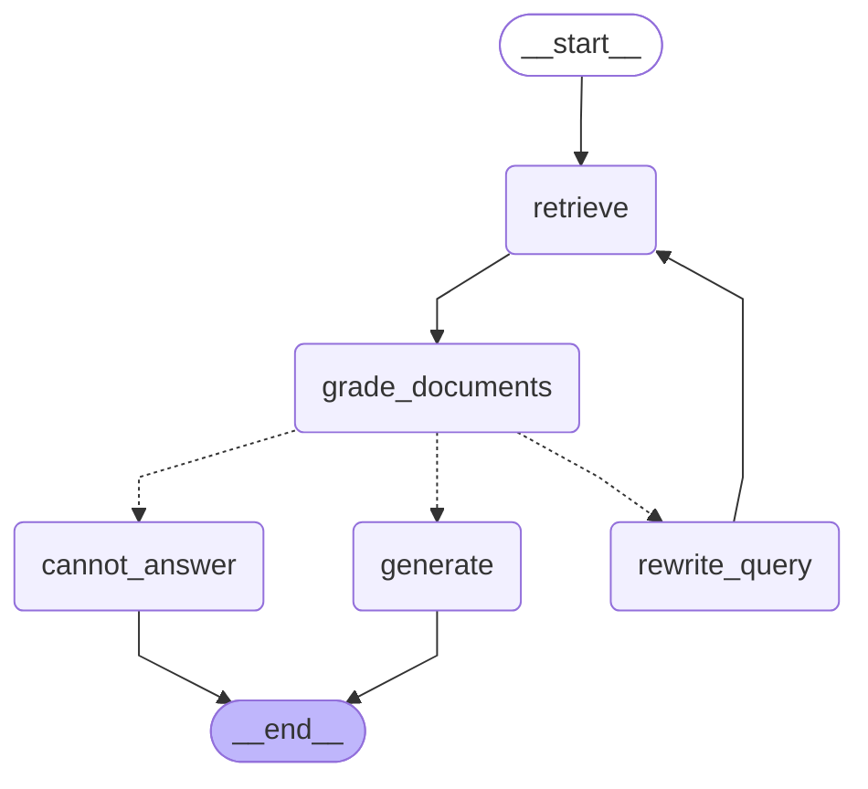

# Week 6 Agentic RAG Workflow Diagram

## 노드 설명

- **retrieve**: Hybrid+Rerank 검색 (5주차 전략). metadata_filter 적용 가능
- **grade_documents**: LLM Judge로 관련성 판단 (relevant/not_relevant)
- **rewrite_query**: Self-Query (카테고리 추출) 또는 Query 재작성 (키워드 추가)
- **generate**: RAG 답변 생성
- **cannot_answer**: 2회 retry 후 답변 거절
