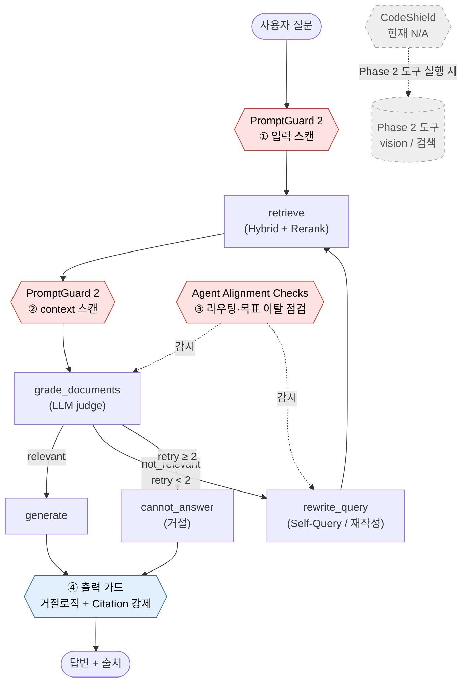

# Week 8 — Agentic RAG Guardrail 부착 위치 (LlamaFirewall 매핑)

> 세미나 핵심 질문 "우리 Agentic RAG에 guardrail을 어디에 어떻게 붙이나"에 대한 그림 1장.
> 기존 4노드 그래프(`docs/week6_workflow_diagram.md`, `src/agent.py`)에 LlamaFirewall 구성요소를 오버레이.
> 본 시스템은 closed-domain(웹·외부도구 미사용, ADR-009)이라 공격 표면이 좁다 — 가드레일은 "필요 지점"에만 표시.

## 부착 위치 ↔ LlamaFirewall 매핑

| # | 위치 | 구성요소 | 막는 리스크 | 현재 상태 |
|---|------|----------|-------------|-----------|
| ① | `retrieve` 직전 — 사용자 질문 | **PromptGuard 2** | 직접 prompt injection / jailbreak | 미적용 (closed-domain이라 우선순위 낮음) |
| ② | `retrieve` → `grade` 사이 — retrieved chunk | **PromptGuard 2** | 매뉴얼 본문·메타데이터를 통한 **간접 injection** | 미적용 (외부 매뉴얼 수집 시 필요) |
| ③ | `grade` / `rewrite` / 라우팅 결정 | **Agent Alignment Checks** | 목표(매뉴얼 QA) 이탈·라우팅 하이재킹 | 라우팅 단순해 리스크 낮음 |
| ④ | `generate` / `cannot_answer` 출력 | (기본 output guard) | 환각·근거 없는 답변 | **적용 중** — 거절 로직(retry≤2 후 cannot_answer) + Citation 강제 |
| — | Phase 2 도구 실행 | **CodeShield** | 도구/코드 실행 오용 | N/A (현재 도구 없음) |

## 메모

- 빨강(◇) = LlamaFirewall 가드 부착점, 파랑 = 현재 적용 중인 기본 출력 가드, 회색 점선 = Phase 2에서 활성화.
- 현재 실제 작동하는 가드는 **④뿐**(거절 + Citation). ①②③은 도구가 늘고 공격 표면이 넓어지는 **Phase 2 시점에 우선 적용** 검토.
- 도구 추가(②의 외부 수집, T의 vision/검색) 시 도구별 **최소 권한 제어**와 간접 injection 테스트 케이스를 평가셋에 추가 — README 보안 섹션 및 ADR과 연결.
